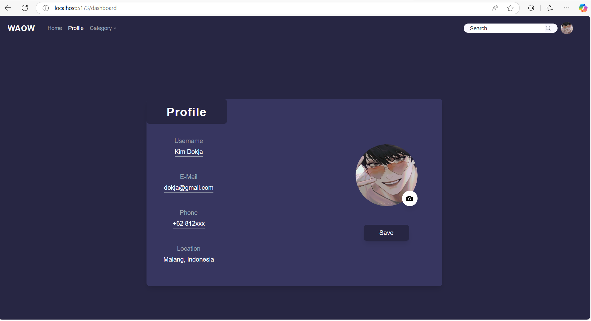
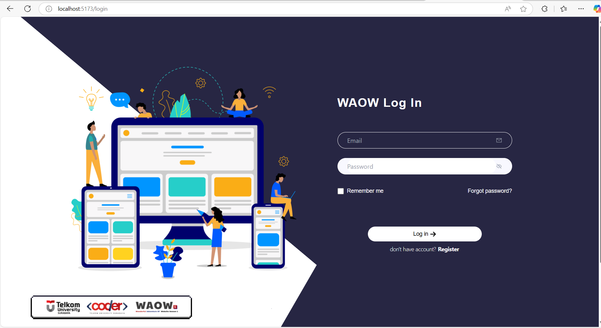
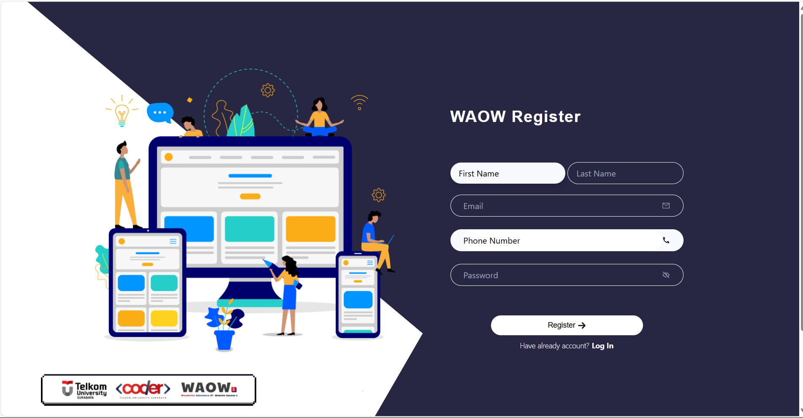

# React Slicing Project

 
Halo! Saya Achmad Michael Mushoharoin telah mengumpulkan tugas slicing dengan menggunakan React. Proyek ini dibuat menggunakan React versi 18, Tailwind CSS, dan React Icons.

## Daftar Halaman

1. [Dashboard](#dashboard)
2. [Login](#login)
3. [Register](#register)

## Dashboard

Halaman dashboard menampilkan informasi pengguna dan beberapa data lainnya.

## Login

Halaman login memungkinkan pengguna untuk masuk ke sistem.

## Register

Halaman register memungkinkan pengguna untuk mendaftar ke sistem.

## Catatan Pengerjaan

Proyek ini saya kerjakan hanya seadanya dan tanpa mempertimbangkan desain responsif karena waktu yang mepet. Saya fokus pada tampilan dasar dan fungsionalitas minimal.

## Teknologi yang Digunakan

- React 18
- Tailwind CSS
- React Icons

## Struktur Folder